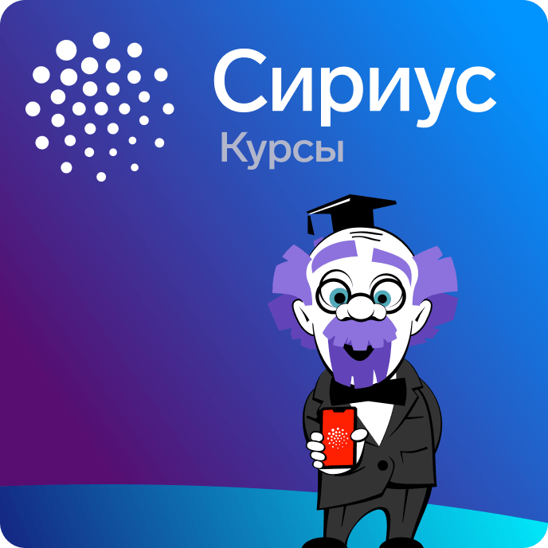

В этом репозитории представлены решения некоторых модулей Сириус курсов.

 

Данный репозиторий предназначен для того, чтобы лучше разобраться в тематике модулей. Используйте его с умом!

Модули:
 - Введение в программирование на языке C++. v1.3
 - Введение в машинное обучение

margin-bottom: 1em;

